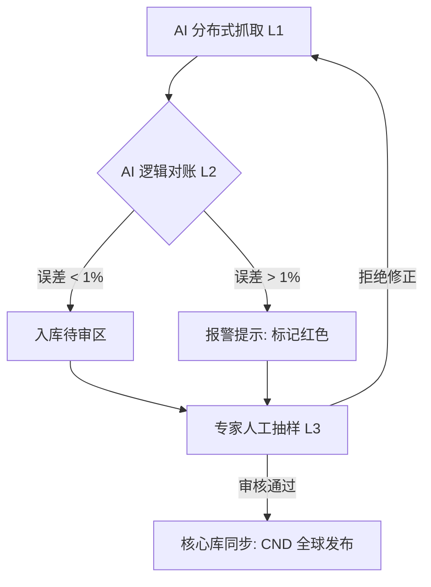

# GoalFinder 管理后台：规则策略与位次校准手册 (v1.0)

> **定位**：本手册定义了管理员如何通过“指挥中心 (Command Center)”对全网抓取的高考数据进行实时人工干预、规则下发与算法校准。

---

## 1. 规则引擎管理模块 (Rule Engine Admin)

系统不再硬编码业务规则，而是通过 **“动态规则池”** 进行管理。

### 1.1 自动抓取与审核流 (AI Rule Extraction)
1. **AI 预审**：系统利用 Gemini 解析各校《招生章程》PDF，自动提取“限报条件”（如：色盲、外语成绩要求）。
2. **人工复核界面**：管理员在后台看板看到：“*【北京理工大学-人工智能专业组】新增数学单科不低于 115 分的限制*”。
3. **一键下发 (Deployment)**：管理员点击“确认”后，系统自动执行全量扫描，将不符合该校该专业的 112 志愿考生进行“高危预警”提示。

### 1.2 动态开关 (Dynamic Flags)
- **投档比例调整**：部分名校可能在投档前临时宣布调档比例由 105% 降至 101%。管理员可在后台搜索该校，实时修改 `admission_ratio` 参数，系统将自动重算全省考生的录取概率。

---

## 2. 位次对冲与校准 (Rank Calibration)

针对高考出分周（72 小时）内数据的剧烈波动，管理员具备“终审校准权”。

### 2.1 扩缩招修正因子 (Enrollment Hedging)
- **场景**：某校今年由“大类招生”拆分为“专业组招生”，且计划总数增加 50 人。
- **校准逻辑**：
    - AI 计算预期位次偏移量 $\Delta R_{ai}$。
    - 管理员进入 **【位次校准面板】**，在可视化曲线上手动滑动调整权重 $W_{adj}$。
    - **系统反馈**：管理员观察该校的“捡漏概率指数”变色（由蓝变金），确认后全网发布。

### 2.2 离群值清洗 (Outlier Cleaning)
- **历史噪点过滤**：如果 2024 年某校因为突发事件（如：疫情封控、校区负面）导致位次暴跌 50000 名，这种数据会干扰趋势图。
- **操作**：管理员可在后台标记该年数据为 `Ignore_In_Trend`，系统在渲染前端趋势图时将自动平滑曲线。

---

## 3. 三级复核工作流 (The T3 Audit Flow)

对标 EMS 级别的安全性，数据发布必须走以下流程：

---

## 4. 核心管理工具：地缘偏好热力图

- **管理员视角**：管理员可以看到当前辽宁省所有考生的“地理偏好”聚类图（如：今年 60% 的 600 分以上考生首选沈阳、大连）。
- **策略建议**：系统基于该热力图，自动提示管理员：“*省内头部院校今年可能出现‘扎堆’现象，建议调高位次稳健系数。*”

---

## 5. UI/UX 建议：Admin 控制台布局

- **左侧**：实时抓取日志流（Scraping Logs）。
- **中间**：位次与计划变更对比曲线（Comparison Charts）。
- **右侧**：待处理规则/数据冲突列表（Action Required）。
