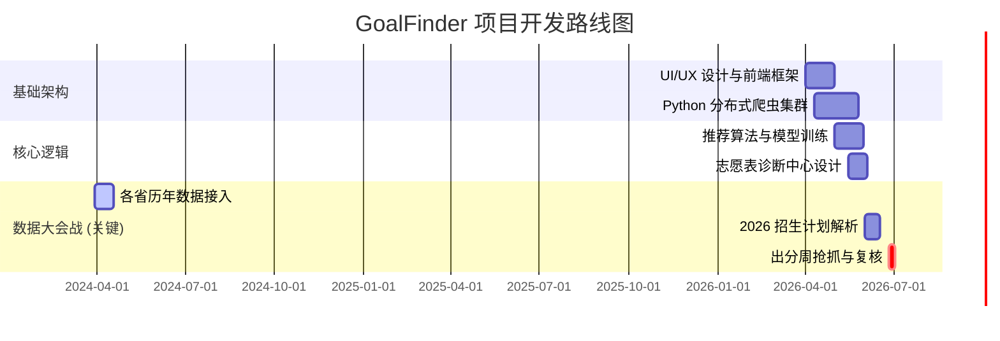

# GoalFinder 高考志愿系统 — 开发路线图与上线时间表 (v1.0)

> **目标**: 确保在 6 月下旬全国高考出分后的 72 小时内，系统具备完整、准确的数据流与高并发支撑能力。

---

## 1. 阶段一：基础建设与架构打通 (现在 - 4月)

**核心目标**: 完成除“今年最新数据”外的一切技术准备。

- [ ] **UI/UX 设计稿精修**：针对“教育类”亲和风格完成全套 Mockup。
- [ ] **数据中台建设**：
  - 核心数据库设计 (PostgreSQL)。
  - 接入历年 (2021-2025) 投档位次原始数据。
- [ ] **爬虫集群部署**：
  - 各省考试院（EEA）反爬策略逐一破解与环境模拟。
  - 代理池、分布式节点测试。
- [ ] **推荐算法 P0 版**：实现基础的位次偏移推荐逻辑。

---

## 2. 阶段二：功能深度开发与压力测试 (5月)

**核心目标**: 提升 AI 语义解析能力，确保系统在大流量下不崩溃。

- [ ] **AI 简章解析层**：利用 Gemini 对数千份高校招生简章进行非结构化提取。
- [ ] **志愿诊断引擎**：开发“梯度校验”与“浪费度评估”系统。
- [ ] **全链路压测**：模拟 10w+ 同时在线用户的填报与实时诊断请求。
- [ ] **管理后台 (Admin)**：完成供人工复核使用的数据对账大屏。

---

## 3. 阶段三：抢金夺秒 — 实时数据攻坚 (6月上旬 - 中旬)

**核心目标**: 实时捕捉官方发布的最新政策与招生计划。

- [ ] **预热抓取**：抓取各校发布的 2026 年最新招生计划（多为 6 月初发布）。
- [ ] **政策情报站**：AI 自动汇总各省考试院关于今年特殊投档规则的变化。
- [ ] **人工复核第一波**：大规模校对招生计划中的扩招/减招数据，并手动标记。

---

## 4. 阶段四：巅峰之战 — 出分填报周 (6月下旬 - 7月初)

**核心目标**: 数据发布后的 24 小时内完成“数据 -> 处理 -> 上线”。

- [ ] **突发抓取**：各省一分一段表（位次表）发布的 2 小时内，完成数据解析入库。
- [ ] **实时算法修正**：根据今年的位次分布，自动校准推荐区间的偏差系数。
- [ ] **7x24h 运维监控**：监控反爬策略失效或服务器负载报警。
- [ ] **三级复核收官**：由团队完成各省投档线数据的最终比对上架。

---

## 5. 项目路线图概览图 (Gantt Chart Concept)

---

## 6. 关键成功要素 (Critical Success Factors)

1. **反爬响应速度**：某省改版后的开发修复速度是系统的生命线。
2. **数据零差错**：通过“AI 交叉验证 + 人工对账”双保险解决。
3. **决策价值**：我们的推荐是否真正优于夸克或百度，取决于位次修正算法的精细度。
