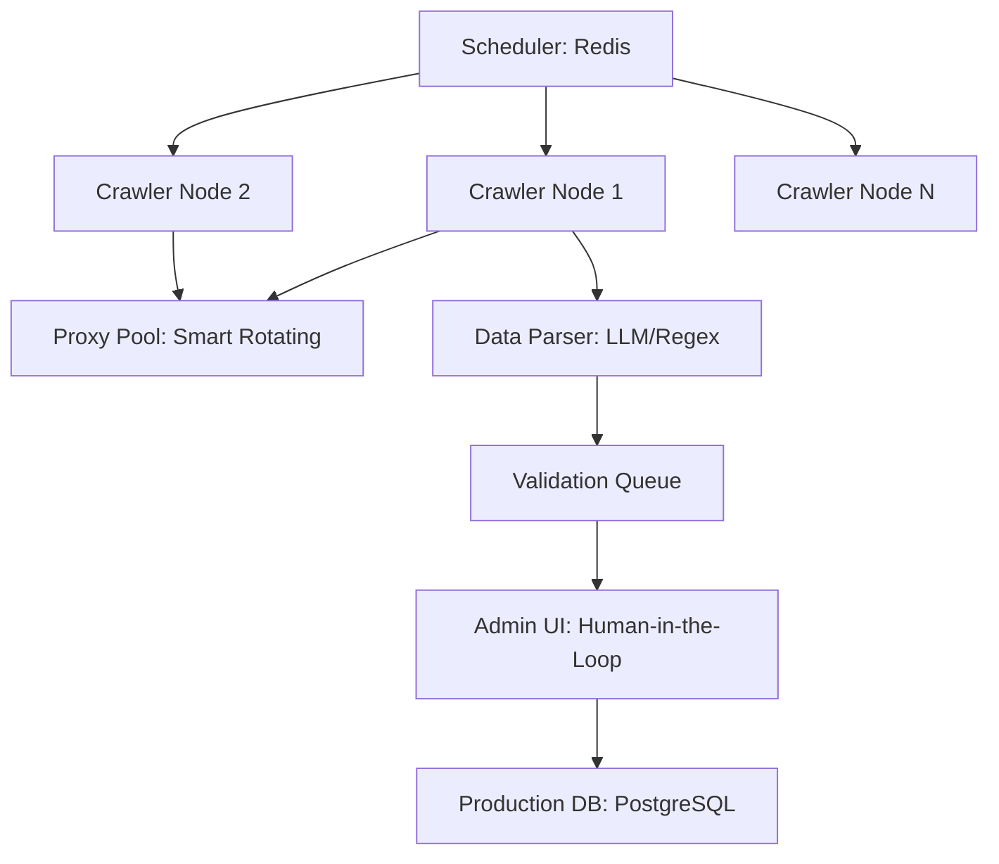

# GoalFinder 数据抓取与分布式架构设计 — 技术方案 (v1.0)

> **技术栈**: Python 3.12+ / Scrapy / Playwright / Redis / Celery / Gemini AI

---

## 1. 业务目标与挑战

### 1.1 核心任务
- **基础库**：全国 2000+ 高校近 3 年的投档位次与专业分数线。
- **动态库**：每年 6 月更新的各省《招生计划》与《招生章程》（多为 HTML/PDF/图片）。
- **实时更新**：志愿填报期间各省市考试院发布的政策异动。

### 1.2 核心挑战 (各省考试院)
- **强反爬虫**：部分省份采用动态混淆、验证码（如滑动条、算术题）。
- **非结构化数据**：大量政策信息嵌入在 PDF 甚至扫描件图片中。
- **突发性访问**：数据发布集中在 2-3 天内，需具备瞬时爆发的并发抓取能力。

---

## 2. 爬虫系统架构 (Distributed Infrastructure)

系统采用 **Master-Slave** 架构，利用 Redis 实现分布式任务调度。

### 2.1 节点设计
- **Scrapy Engine**：负责高频率、规则化的文本网页抓取。
- **Playwright 渲染层**：针对强 JS 渲染或需要行为模拟（如登录、点击）的页面。
- **分布式调度**：`scrapy-redis` 确保不同省份的任务互不冲突，并支持断点续传。

---

## 3. 反爬虫应对策略 (Anti-Crawling Rituals)

### 3.1 身份模拟与伪装
- **IP 代理池 (Proxy Pool)**：集成专业级动态住宅代理，每 30s 自动切换区域 IP。
- **UA & Header 混淆**：基于 `fake-useragent` 模拟多种移动端与桌面端主流浏览器版本。
- **行为指纹抹除**：针对 Playwright 进行 `canvas/webgl` 等高级指纹抹除，避免被识别为 Headless。

### 3.2 验证码与阻断应对
- **AI 视觉解析**：对于数字、算术验证码，利用 **Gemini Pro Vision** 进行一站式识别。
- **模拟人工轨迹**：通过 Playwright 模拟人类随机滑动/停顿路径。
- **自适应重试**：遇到 403 或 频繁重放时，自动指数退避并报警，切换抓取频率。

---

## 4. AI 数据清洗与解析 (AI Data Cleaner)

### 4.1 非结构化文本提取 (LLM Ingestion)
- **PDF 解析**：使用 `pdfplumber` 提取表格，对于图片类 PDF 转为 `base64` 发送至 Gemini 接口，直接返回结构化 JSON。
- **逻辑提取**：AI 自动识别简章中的“关键限制”（如：视力要求、选科必考、学费阶梯）。

### 4.2 冲突检测
- 抓取到新数据后，与生产库中历史数据进行对比。若位次涨跌幅 >30% 或 学校代码变化，自动标记为“待审核”。

---

## 5. 人工复核工作流 (Human Review)

为了确保“高考填报”这一严肃场景下的 100% 准确性，本系统强制引入人工复核：

1. **初筛**：机器自动规则校验（数据类型、位次递增检查）。
2. **复核**：由专业团队通过 **数据对账台 (Admin Tool)** 与官方纸质《招生指南》进行抽样校对。
3. **最终确认**：由“省份负责人”点击 Overwrite 写入正式库。

---

## 6. 技术风险提示 (Technical Risks)

| 风险点 | 应对方案 |
| :--- | :--- |
| **考试院临时改版** | 建立 `Snapshot` 机制，发现结构变化立即全网报警，开发响应时间控制在 2 小时内。 |
| **IP 池被大规模拉黑** | 准备 3 套不同的代理供应商，支持秒级切换。 |
| **PDF 表格行列错位** | 使用 `tabula-py` 辅以 AI 表格纠错逻辑，确保行列对齐。 |

---

## 7. 模块化代码规划 (Python Package)

- `volunteer_spiders/`: 核心爬虫核心。
- `volunteer_nlp/`: 基于 LLM 的文本解析工具。
- `volunteer_infra/`: 代理管理、Redis 调度、Celery 监控。
- `volunteer_validation/`: 数据清洗与合规性校验逻辑。
